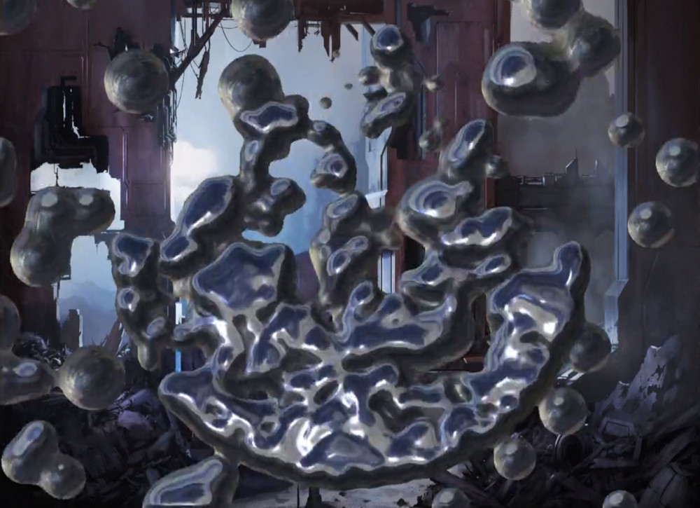

# Simple 2D Physics Playground

Just some small 2D particle physics demos, and simple softbody and spring-mass system experiments.

# Clone the repository

```git clone https://github.com/pjhusky/2d-physics-js.git```

# Running a demo (web)

Live Demo: [Metaball Fluids](https://htmlpreview.github.io/?https://github.com/pjhusky/2d-physics-js/main/index.html&demoMetaballFluid&fluidAsBlobs&useStickyGooLook&drawBackgroundMetaballs)
<!--  -->
<!--
<a href="https://user-images.githubusercontent.com/10312640/235639664-820b8b52-13a4-436d-afc4-f7ac595b5329.mp4" title="Metaball Particles">
  <p align="center">
    
  </p>
</a>
-->
https://user-images.githubusercontent.com/10312640/235639664-820b8b52-13a4-436d-afc4-f7ac595b5329.mp4


Live Demo: [Metaball Fluids with CRT Filter](https://htmlpreview.github.io/?https://github.com/pjhusky/2d-physics-js/main/index.html&demoMetaballFluid&fluidAsBlobs&useStickyGooLook&useCrtFilter)


Live Demo: [Colored Particles](https://htmlpreview.github.io/?https://github.com/pjhusky/2d-physics-js/main/index.html&demoPictureParticle&useCircleOutline)
<!--  -->
https://user-images.githubusercontent.com/10312640/235639750-52d3ddd1-e786-4ed8-9d08-8ba75c73bd95.mp4


Live Demo: [Softbodies](https://htmlpreview.github.io/?https://github.com/pjhusky/2d-physics-js/main/index.html&drawSoftbodies)


# Running a demo (local http server)

Start a simple local http server, for example:

```python3 -m http.server 8000```

Then open your browser and type something along these lines:

```http://localhost:8000/index.html?demoPictureParticle&useCircleOutline&useCrtFilter```
<!-- [Colored Particles with CRT Filter](http://localhost:8000/index.html?demoPictureParticle&useCircleOutline&useCrtFilter) -->


# Supported parameters

- demoMetaballFluid
- fluidAsBlobs
- useStickyGooLook
<br>

- demoPictureParticle
- useCircleOutline
<br>

- drawBackgroundMetaballs
<br>

- drawSoftbodies
<br>

- drawSpringTestSprites
<br>

- useCrtFilter
<br>

- recordingEnabled
<br>